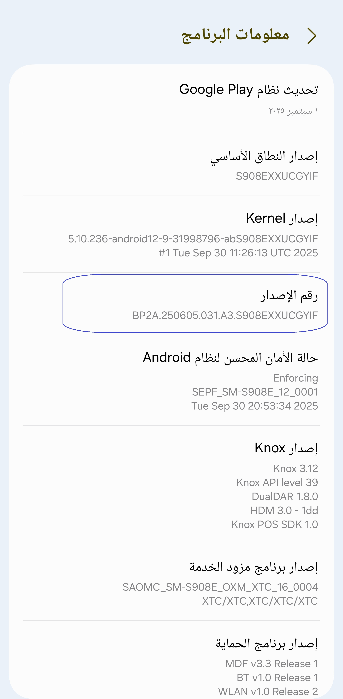
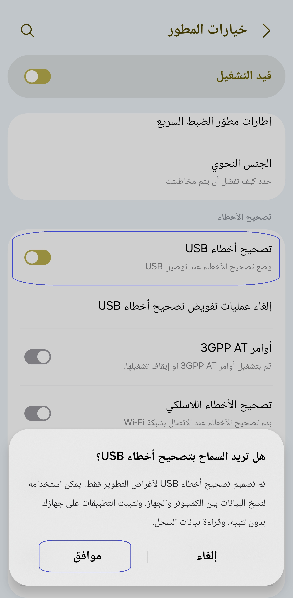
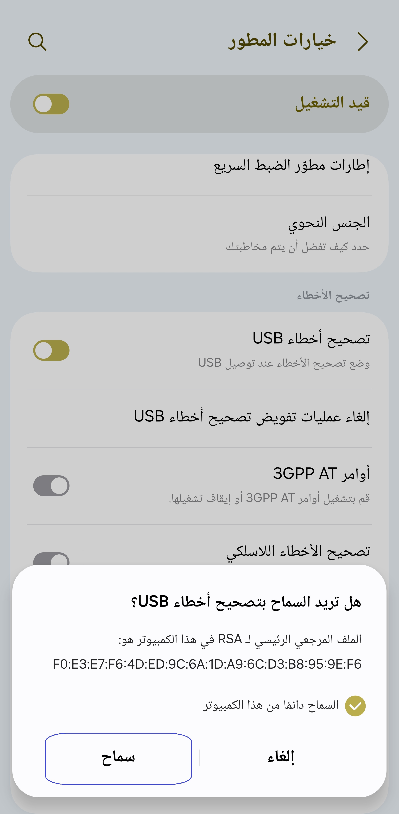

[English](../../README.md) | [Español](../es/README.md)
| [Português](../pt/README.md) | [Bahasa Indonesia](../in/README.md)
| [Русский](../ru/README.md) | [中文 (简体)](../zh-rCN/README.md) | [中文 (繁體)](../zh-rTW/README.md)
| [日本語](../ja-rJP/README.md) | [Tiếng Việt](../vi/README.md)
| [Türkçe](../tr/README.md)
| [हिन्दी](../hi/README.md) | [বাংলা (ভারত)](../bn-rIN/README.md) | [ਪੰਜਾਬੀ (ਭਾਰਤ)](../pa-rIN/README.md) | [తెలుగు](../te-rIN/README.md) | [اردو (پاکستان)](../ur-rPK/README.md) | <u>[العربية](README.md)</u> | [ไทย](../th/README.md)

----------------------

### TL;DR

* نفذ `adb shell appops set com.tribalfs.realtimefps PROJECT_MEDIA allow`
* إذا كنت تستخدم تطبيق طرفية أندرويد بإذن مرتفع ،
  نفذ `pm grant com.tribalfs.realtimefps android.permission.PROJECT_MEDIA`

----------------------

منح الإذن باستخدام جهاز كمبيوتر:
----------------------

<details>

### 1. قم بتمكين وضع المطور في إعدادات الهاتف

<details>

* اذهب إلى _الإعدادات_ > _حول الهاتف_ > _معلومات البرنامج_ وانقر على _رقم الإصدار_ سبع (7) مرات
  متتالية لتمكين خيارات المطور.

  

</details>

### 2. قم بتمكين تصحيح أخطاء USB

<details>

* اذهب إلى _الإعدادات_ > _خيارات المطور_ (يمكن أن تكون _الإعدادات_ > _النظام_ > _خيارات المطور_ على
  إصدارات أندرويد الأقدم) ، قم بالتمرير لأسفل وابحث عن خيار _تصحيح أخطاء USB_.

  

#### ملاحظات لبعض الأجهزة مثل MIUI:

* قم بتشغيل _تصحيح أخطاء USB لإعدادات الأمان_ أيضًا إذا كان موجودًا في خيار المطور.

* قم بتشغيل خيار _تعطيل مراقبة الأذونات_ إذا كان موجودًا في خيارات المطور. إعادة التشغيل مطلوبة.

</details>

### 3. قم بتنزيل ADB على جهاز الكمبيوتر الخاص بك

<details>

* قم بتنزيل ADB (platform-tools) على جهاز الكمبيوتر الخاص بك:
  لـ [Windows](https://dl.google.com/android/repository/platform-tools-latest-windows.zip) |
  لـ [Mac](https://dl.google.com/android/repository/platform-tools-latest-darwin.zip) |
  لـ [Linux](https://dl.google.com/android/repository/platform-tools-latest-linux.zip)

* قم باستخراج ملف zip الذي تم تنزيله.

</details>

### 4. انتقل إلى داخل

مجلد `platform-tools` الذي قمت باستخراجه على مستكشف Windows أو Finder (macOS)

### 5. فتح واجهة سطر الأوامر

  <details>

#### بالنسبة لنظام التشغيل Windows: افتح CMD

* اكتب `cmd` في شريط العنوان واضغط على Enter. سيؤدي هذا إلى فتح تطبيق موجه أوامر Windows
  .

  

#### بالنسبة لنظام التشغيل macOS:

* انقر نقرًا مزدوجًا فوق ملف zip الذي تم تنزيله لفتحه، ثم انقر بزر الماوس الأيمن فوق مجلد
  `platform-tools` لفتح قائمة السياق ثم انقر فوق _Services_ > _New Terminal at Folder_.

</details>

### 6. توصيل هاتفك بجهاز الكمبيوتر الخاص بك

  <details>

* سيطالبك هاتفك بـ _السماح بتصحيح أخطاء USB_ إذا كانت هذه هي المرة الأولى التي يتم فيها توصيله في
  وضع تصحيح أخطاء USB
  . انقر فوق _السماح_ أو _موافق_.
* يمكنك تحديد _السماح دائمًا من هذا الكمبيوتر_ (يرجى مراجعة الملاحظة في نهاية
  هذا البرنامج التعليمي حول إبقاء تصحيح أخطاء USB ممكّنًا).

  

* تحقق من الاتصال عن طريق إدخال الأمر التالي متبوعًا بإدخال. يجب أن يظهر
  معرف جهازك إذا تم الاتصال بنجاح.

> ```adb devices```


* إذا فشل جهازك في الاتصال بجهاز الكمبيوتر الخاص بك ، فحاول توصيله بمنفذ USB مختلف و / أو
  استخدام كابل بيانات USB مختلف. إذا لم يتم الاتصال بعد ، فمن المحتمل أن يكون جهاز الكمبيوتر الخاص
  بك يفتقد
  برنامج تشغيل USB لهاتفك.
  تحقق [هنا لتنزيل برامج تشغيل USB OEM](https://developer.android.com/studio/run/oem-usb#Drivers).
  بمجرد التثبيت ، أعد تشغيل جهاز الكمبيوتر الخاص بك وأعد الخطوة رقم 6.

</details>

### 7. المنح الفعلي لإذن PROJECT_MEDIA

  <details>

* عند الاتصال بنجاح ، أدخل الأمر التالي واضغط على Enter. يمكنك نسخ الأمر
  أدناه. إذا تم تنفيذ الأمر بشكل صحيح ، فسيعود فارغًا.

> ```adb shell appops set com.tribalfs.realtimefps PROJECT_MEDIA allow```

* إذا طالب `adb.exe: more than one device/emulator...` ، فنفذ ما يلي بدلاً من ذلك:

>
```adb -s [معرف الجهاز الموضح في الخطوة 6] shell appops set com.tribalfs.realtimefps PROJECT_MEDIA allow```


#### ملاحظة لأجهزة MIUI و OnePlus وبعض الأجهزة الأخرى

إذا حصلت على خطأ `java.lang.SecurityException: grantRuntimePermission` ، فاتبع الخطوات التالية:

1. اذهب إلى _الإعدادات_ > _خيارات المطور_ (يمكن أن تكون _الإعدادات_ > _النظام_ > _خيارات المطور_
2. قم بالتمرير لأسفل وقم بتمكين **تصحيح أخطاء USB (إعدادات الأمان)**
3. إذا ظهر أي _حوار تحذير_ ، فاتبع خطواته للمتابعة.
4. أعد تشغيل جهازك وحاول خطوات القسم 7 مرة أخرى.

**هذا كل شيء!**
</details>

#### يمكنك الآن تعطيل إعدادات تصحيح أخطاء USB

* اذهب إلى _الإعدادات_ > _خيارات المطور_ ، قم بالتمرير لأسفل صفحة و **عطّل** خيار _تصحيح أخطاء USB_
  .

</details>

----------------------

منح الإذن بدون استخدام جهاز كمبيوتر (باستخدام Shizuku):
----------------------
<details>

## الخيارات المتاحة

### 🟢 الخيار 1

يمكنك تثبيت [Shizuku](https://play.google.com/store/apps/details?id=moe.shizuku.privileged.api)*  
وتفعيله باتباع دليل الإعداد الخاص به.  
بعد ذلك، يمكنك العودة إلى تطبيق _Real-time FPS_ لمنحه الأذونات عن طريق تطبيق دقة الشاشة.

*إذا كان إصدار متجر Play لا يعمل على جهازك، فيمكنك
استخدام [نسخة Shizuku هذه](https://github.com/thedjchi/Shizuku/releases) بدلاً من ذلك.

---

</details>


----------------------

### لست مضطرًا لتكرار هذه العملية إلا إذا قمت بإلغاء تثبيت التطبيق بالكامل وإعادة تثبيته.


