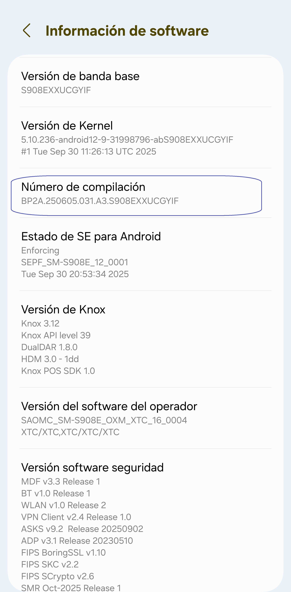
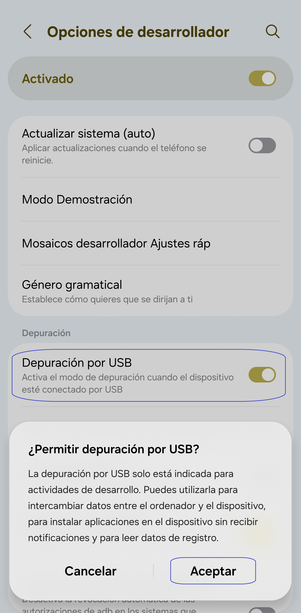
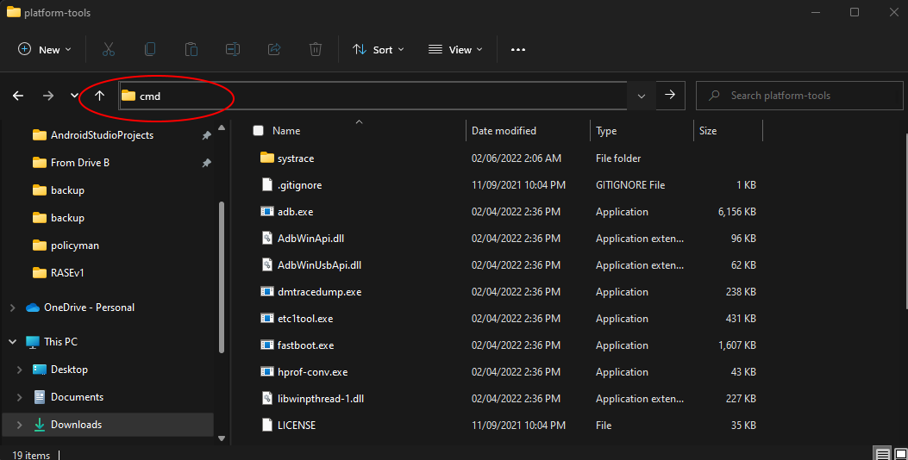
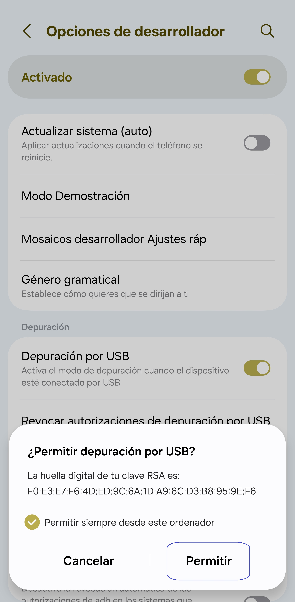

[English](../../README.md) | <u>[Español](README.md)</u>
| [Português](../pt/README.md) | [Bahasa Indonesia](../in/README.md)
| [Русский](../ru/README.md) | [中文 (简体)](../zh-rCN/README.md) | [中文 (繁體)](../zh-rTW/README.md)
| [日本語](../ja-rJP/README.md) | [Tiếng Việt](../vi/README.md)
| [Türkçe](../tr/README.md)
| [हिन्दी](../hi/README.md) | [বাংলা (ভারত)](../bn-rIN/README.md) | [ਪੰਜਾਬੀ (ਭਾਰਤ)](../pa-rIN/README.md) | [తెలుగు](../te-rIN/README.md) | [اردو (پاکستان)](../ur-rPK/README.md) | [العربية](../ar/README.md) | [ไทย](../th/README.md)

----------------------

### TL;DR

* Ejecuta `adb shell appops set com.tribalfs.realtimefps PROJECT_MEDIA allow`

* Si utilizas una aplicación de terminal en Android con permisos elevados,
  ejecuta `pm grant com.tribalfs.realtimefps android.permission.PROJECT_MEDIA`

----------------------

Otorgar permiso usando un PC:
----------------------

<details>

### 1. Activa el modo desarrollador en la configuración del teléfono

<details>

* Ve a _Ajustes_ > _Acerca del teléfono_ > _Información de software_ y toca _Número de compilación_
  sucesivamente siete (7) veces para habilitar las opciones de desarrollador.

  

</details>

### 2. Habilita la _Depuración por USB_

<details>

* Ve a _Ajustes_ > _Opciones de desarrollador_ (o _Ajustes_ > _Sistema_ > _Opciones de
  desarrollador_ en
  versiones antiguas de Android),
  desplázate hacia abajo y activa la opción _Depuración por USB_.

  )

#### Notas para algunos dispositivos como MIUI:

* Activa también la opción _Depuración por USB para configuraciones de seguridad_ si aparece en las
  opciones de desarrollador.

* Activa la opción _Desactivar supervisión de permisos_ si está disponible. Se requiere reiniciar el
  dispositivo.

</details>

### 3. Descarga ADB en tu ordenador

<details>

* Descarga ADB (platform-tools) en tu computadora:
  para [Windows](https://dl.google.com/android/repository/platform-tools-latest-windows.zip)
  | para [Mac](https://dl.google.com/android/repository/platform-tools-latest-darwin.zip)
  | para [Linux](https://dl.google.com/android/repository/platform-tools-latest-linux.zip)

* Extrae el archivo ZIP descargado.

</details>

### 4. Navega dentro de la carpeta

`platform-tools` que extrajiste en el Explorador de Windows o Finder (macOS)

### 5. Abre la interfaz de línea de comandos

<details>

#### En Windows: Abre CMD

* Escribe `cmd` en la barra de direcciones y presiona Enter. Esto abrirá el símbolo del sistema.

  

#### Para macOS:

* Haz doble clic en el archivo zip descargado para abrirlo, haz clic derecho en la carpeta
  `platform-tools` para abrir el menú contextual y luego haz clic en
  _Servicios_ > _Nueva terminal en la carpeta_.

</details>

### 6. Conecta tu teléfono al ordenador

<details>

* Tu teléfono mostrará el mensaje _Permitir depuración por USB_ si es la primera vez que lo
  conectas.
  Toca _Permitir_.

* Puedes marcar la casilla _Permitir siempre desde este ordenador_ (revisa la nota al final de este
  tutorial sobre mantener activada la depuración USB).



* Comprueba la conexión introduciendo el siguiente comando y presionando Enter. Debería mostrar el
  ID de tu dispositivo si la conexión fue exitosa.

> ```adb devices```


* Si tu dispositivo no logra conectarse, prueba con otro puerto USB o cable de datos diferente.
  Si aún así no conecta, puede que tu ordenador no tenga instalados los controladores USB del
  dispositivo.
  Consulta (aquí para descargar los controladores
  OEM)[https://developer.android.com/studio/run/oem-usb#Drivers].
  Una vez instalados, reinicia tu PC y repite el paso 6.

</details>

### 7. Otorgar el permiso PROJECT_MEDIA

<details>

* Una vez conectado correctamente, introduce el siguiente comando y presiona Enter.
  Puedes copiar y pegar el comando. Si se ejecuta correctamente, no mostrará ningún mensaje.

> ```adb shell appops set com.tribalfs.realtimefps PROJECT_MEDIA allow```

* Si aparece el error `adb.exe: more than one device/emulator...`, ejecuta en su lugar:

>
```adb -s [ID del dispositivo mostrado en el paso 6] shell appops set com.tribalfs.realtimefps PROJECT_MEDIA allow```


#### Nota para MIUI, OnePlus y algunos otros dispositivos

Si obtienes el error `java.lang.SecurityException: grantRuntimePermission`, sigue estos pasos:

1. Ve a Ajustes > Opciones de desarrollador (o Ajustes > Sistema > Opciones de desarrollador)
2. Activa Depuración USB (Configuraciones de seguridad)
3. Si aparece algún diálogo de advertencia, sigue sus instrucciones.
4. Reinicia tu dispositivo y repite los pasos de la sección 7.

**¡Eso es todo!**

</details>

#### Ahora puedes desactivar la depuración USB

* Si no necesitas la depuración USB, puedes desactivarla para evitar posibles accesos no deseados:
  Ajustes > Opciones de desarrollador > Desactiva la opción Depuración USB.

</details>

----------------------
Otorgar permiso sin usar una PC (usando Shizuku):
----------------------
<details>

### Opción 1: Puedes instalar [Shizuku](https://play.google.com/store/apps/details?id=moe.shizuku.privileged.api)*

y activarlo siguiendo la guía proporcionada. Luego, vuelve a la aplicación _Real-time FPS_ para
otorgarle
permisos
aplicando una resolución.

*Si la versión de Play Store no funciona en tu dispositivo, puedes usar
esta [bifurcación de Shizuku](https://github.com/thedjchi/Shizuku/releases) en su lugar.

</details>


----------------------

### No es necesario repetir este proceso a menos que desinstales completamente la aplicación y la vuelvas a instalar.
