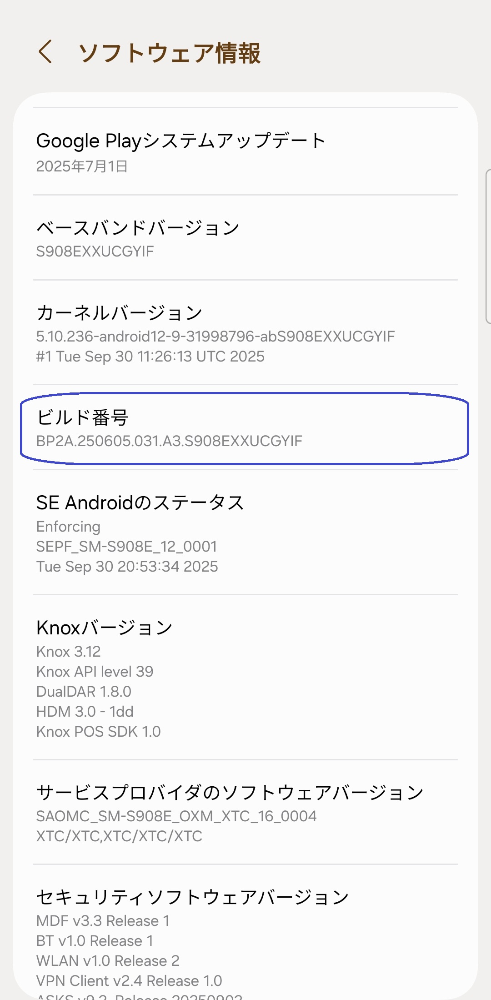
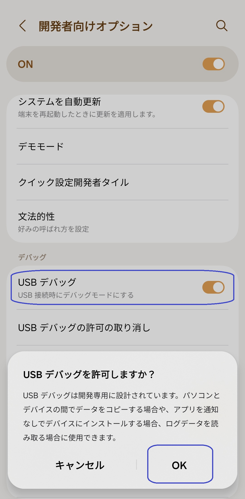
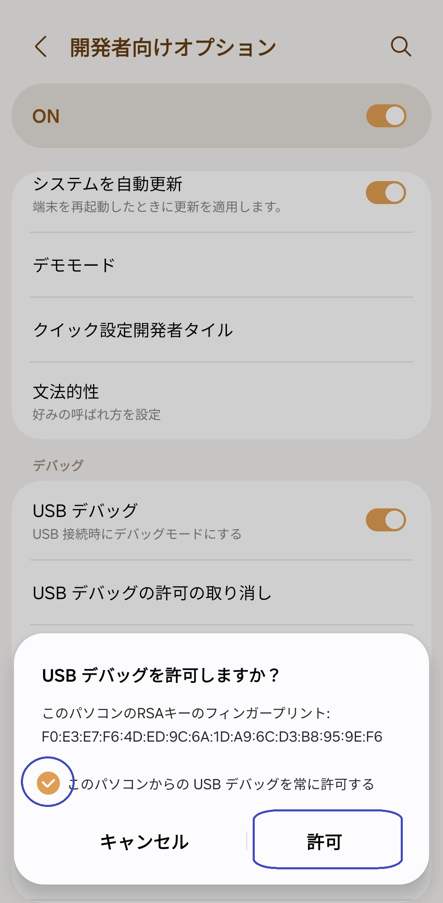

[English](../../README.md) | [Español](../es/README.md)
| [Português](../pt/README.md) | [Bahasa Indonesia](../in/README.md)
| [Русский](../ru/README.md) | [中文 (简体)](../zh-rCN/README.md) | [中文 (繁體)](../zh-rTW/README.md)
| <u>[日本語](README.md)</u> | [Tiếng Việt](../vi/README.md)
| [Türkçe](../tr/README.md)
| [हिन्दी](../hi/README.md) | [বাংলা (ভারত)](../bn-rIN/README.md) | [ਪੰਜਾਬੀ (ਭਾਰਤ)](../pa-rIN/README.md) | [తెలుగు](../te-rIN/README.md) | [اردو (پاکستان)](../ur-rPK/README.md) | [العربية](../ar/README.md) | [ไทย](../th/README.md)

----------------------

### 要約

* `adb shell appops set com.tribalfs.realtimefps PROJECT_MEDIA allow` を実行します。
* 昇格された権限を持つAndroidターミナルアプリを使用している場合は、
  `appops set com.tribalfs.realtimefps PROJECT_MEDIA allow` を実行します。

----------------------

PCを使用して権限を付与する：
----------------------

<details>

### 1. スマートフォンの設定で開発者モードを有効にする

<details>

* _設定_ > _端末情報_ > _ソフトウェア情報_ に移動し、開発者向けオプションを有効にするために
  _ビルド番号_ を連続して7回タップします。

  

</details>

### 2. USBデバッグを有効にする

<details>

* _設定_ > _開発者向けオプション_（古いAndroidバージョンでは _設定_ > _システム_ >
  _開発者向けオプション_ の場合があります）
  に移動し、下にスクロールして _USBデバッグ_ オプションを見つけます。

  

#### MIUIなどの一部のデバイスに関する注意：

* 開発者向けオプションに _USBデバッグ（セキュリティ設定）_ がある場合は、それもオンにします。

* 開発者向けオプションに _権限モニタリングを無効にする_ オプションがある場合は、オンにします。再起動が必要です。

</details>

### 3. コンピューターにADBをダウンロードする

<details>

* ADB（platform-tools）をコンピューターにダウンロードします：
  [Windows](https://dl.google.com/android/repository/platform-tools-latest-windows.zip)用 |
  [Mac](https://dl.google.com/android/repository/platform-tools-latest-darwin.zip)用 |
  [Linux](https://dl.google.com/android/repository/platform-tools-latest-linux.zip)用

* ダウンロードしたzipファイルを解凍します。

</details>

### 4. WindowsエクスプローラーまたはFinder（macOS）で解凍した`platform-tools`フォルダーに移動します

### 5. コマンドラインインターフェイスを開く

  <details>

#### Windowsの場合：CMDを開く

* アドレスバーに `cmd` と入力してEnterキーを押します。これにより、Windowsコマンドプロンプトアプリケーションが開きます。

  

#### macOSの場合：

* ダウンロードしたzipをダブルクリックして開き、`platform-tools`
  フォルダを右クリックしてコンテキストメニューを開き、[サービス] > [フォルダで新しいターミナル]
  をクリックします。

</details>

### 6. スマートフォンをコンピューターに接続する

  <details>

* USBデバッグモードで初めて接続する場合、スマートフォンに _USBデバッグを許可しますか？_
  というプロンプトが表示されます。_許可_ または _OK_ をタップします。
* _このコンピューターから常に許可する_
  にチェックを入れることもできます（USBデバッグを有効に保つことに関するチュートリアルの最後にある注意を確認してください）。
* 

* 次のコマンドを入力してEnterキーを押し、接続を確認します。正常に接続されると、デバイスIDが表示されます。

> ```adb devices```


*

デバイスがコンピューターに接続できない場合は、別のUSBポートに接続するか、別のUSBデータケーブルを使用してみてください。それでも接続できない場合は、コンピューターにスマートフォンのUSBドライバーがない可能性があります。[こちらからOEM USBドライバーをダウンロード](https://developer.android.com/studio/run/oem-usb#Drivers)
してください。インストール後、PCを再起動して手順6をやり直してください。

</details>

### 7. Real-time FPS MonitorへのPROJECT_MEDIA権限の実際の付与

  <details>

* 正常に接続されたら、次のコマンドを入力してEnterキーを押します。以下のコマンドをコピーできます。コマンドが正しく実行されると、何も表示されません。

> ```adb shell appops set com.tribalfs.realtimefps PROJECT_MEDIA allow```

* `adb.exe: more than one device/emulator...` というプロンプトが表示された場合は、代わりに次のコマンドを実行します。

>
```adb -s [手順6で表示されたデバイスID] shell appops set com.tribalfs.realtimefps PROJECT_MEDIA allow```


#### MIUI, OnePlus, その他のデバイスに関する注意

`java.lang.SecurityException: grantRuntimePermission` エラーが発生した場合は、次の手順に従ってください。

1. _設定_ > _開発者向けオプション_ (または _設定_ > _システム_ > _開発者向けオプション_) に移動します
2. 下にスクロールして **USBデバッグ (セキュリティ設定)** を有効にします
3. _注意ダイアログ_ が表示された場合は、その手順に従って続行します。
4. デバイスを再起動し、セクション7の手順を再試行してください。

**以上です！**
</details>

#### これでUSBデバッグ設定を無効にできます

* _設定_ > _開発者向けオプション_ に移動し、ページを下にスクロールして _USBデバッグ_ オプションを *
  *無効** にします。

</details>

----------------------
PCを使用せずに権限を付与する（Shizukuを使用）：
----------------------
<details>

### オプション 1: [Shizuku](https://play.google.com/store/apps/details?id=moe.shizuku.privileged.api)* をインストールできます

提供されているガイドに従ってアクティブ化します。その後、_Real-time FPS_ アプリに戻り、Shizuku
を使用して権限を付与します。

*

Playストア版がデバイスで動作しない場合は、代わりにこの[Shizukuフォーク](https://github.com/thedjchi/Shizuku/releases)
を使用してください。

</details>


----------------------

### アプリを完全にアンインストールして再インストールしない限り、このプロセスを繰り返す必要はありません。

