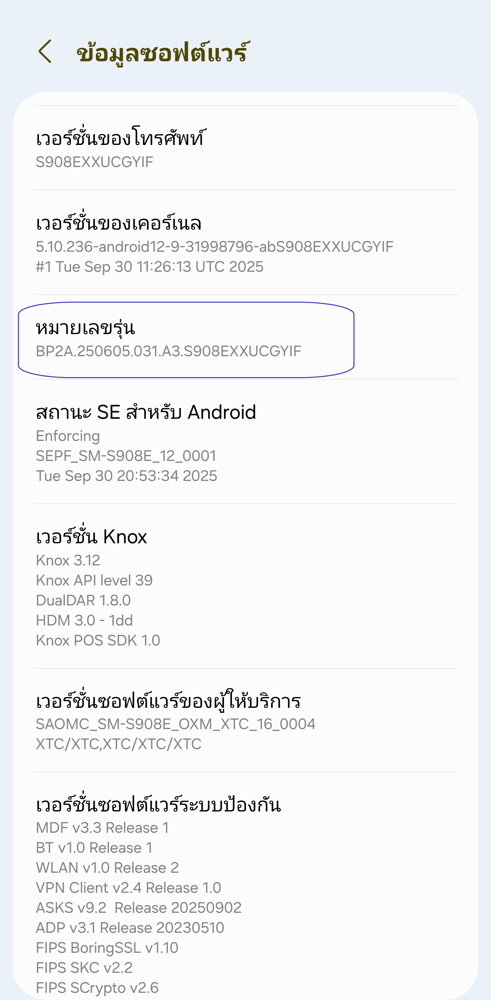
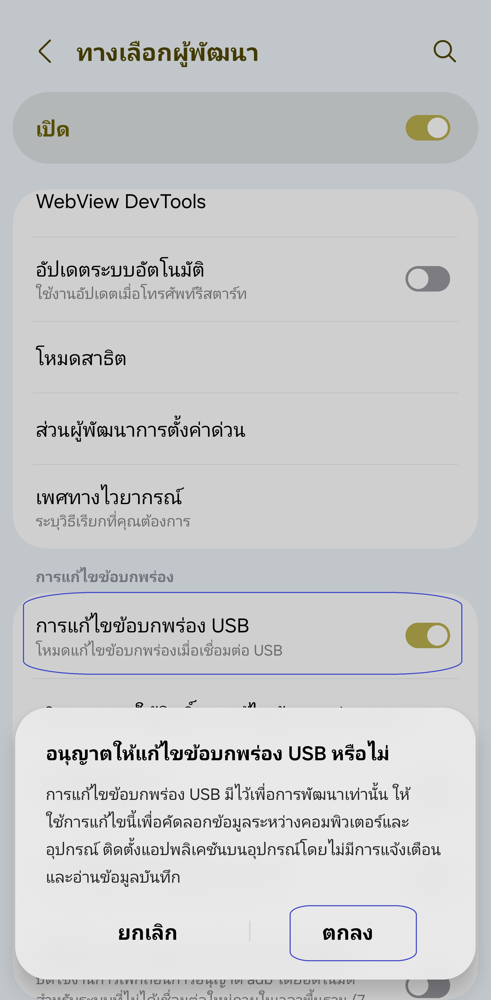
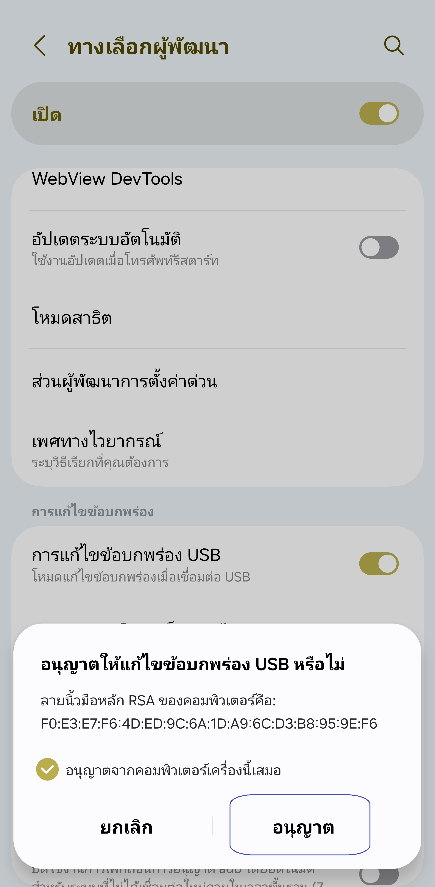
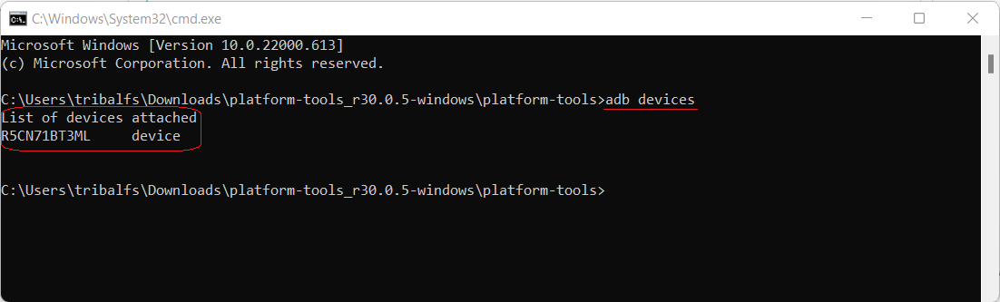

[English](../../README.md) | [Español](../es/README.md)
| [Português](../pt/README.md) | [Bahasa Indonesia](../in/README.md)
| [Русский](../ru/README.md) | [中文 (简体)](../zh-rCN/README.md) | [中文 (繁體)](../zh-rTW/README.md)
| [日本語](../ja-rJP/README.md) | [Tiếng Việt](../vi/README.md)
| [Türkçe](../tr/README.md)
| [हिन्दी](../hi/README.md) | [বাংলা (ভারত)](../bn-rIN/README.md) | [ਪੰਜਾਬੀ (ਭਾਰਤ)](../pa-rIN/README.md) | [తెలుగు](../te-rIN/README.md) | [اردو (پاکستان)](../ur-rPK/README.md) | [العربية](../ar/README.md) | <u>[ไทย](README.md)</u>

----------------------

### TL;DR

* รันคำสั่ง `adb shell appops set com.tribalfs.realtimefps PROJECT_MEDIA allow`
* หากใช้แอปเทอร์มินัลบน Android ที่มีสิทธิ์ระดับสูง ให้รันคำสั่ง  
  `pm grant com.tribalfs.realtimefps android.permission.PROJECT_MEDIA`

----------------------

การให้สิทธิ์โดยใช้พีซี:
----------------------

<details>

### 1. เปิดโหมดนักพัฒนา (Developer Mode) ในการตั้งค่าของโทรศัพท์

<details>

* ไปที่ _การตั้งค่า_ > _เกี่ยวกับโทรศัพท์_ > _ข้อมูลซอฟต์แวร์_ และแตะ _หมายเลขบิลด์_ ติดต่อกันเจ็ด (
    7) ครั้ง เพื่อเปิดใช้งานตัวเลือกสำหรับนักพัฒนา

  

</details>

### 2. เปิดการดีบัก USB (USB Debugging)

<details>

* ไปที่ _การตั้งค่า (Settings)_ > _ตัวเลือกสำหรับนักพัฒนา (Developer options)_  
  (อาจอยู่ที่ _การตั้งค่า (Settings)_ > _ระบบ (System)_ > _ตัวเลือกสำหรับนักพัฒนา (Developer
  options)_ ใน Android รุ่นเก่า)  
  เลื่อนลงและเปิดใช้งาน _การดีบัก USB (USB debugging)_

  

#### หมายเหตุสำหรับบางอุปกรณ์ เช่น MIUI:

* เปิด _USB Debugging (Security Settings)_ หากมีตัวเลือกนี้ในเมนูนักพัฒนา

* เปิด _Disable permission monitoring_ หากมีตัวเลือกนี้ด้วย (จำเป็นต้องรีสตาร์ทเครื่อง)

</details>

### 3. ดาวน์โหลด ADB ลงในคอมพิวเตอร์ของคุณ

<details>

* ดาวน์โหลด ADB (platform-tools) มายังคอมพิวเตอร์ของคุณ:  
  สำหรับ [Windows](https://dl.google.com/android/repository/platform-tools-latest-windows.zip) |  
  สำหรับ [Mac](https://dl.google.com/android/repository/platform-tools-latest-darwin.zip) |  
  สำหรับ [Linux](https://dl.google.com/android/repository/platform-tools-latest-linux.zip)

* แตกไฟล์ ZIP ที่ดาวน์โหลดมา

</details>

### 4. ไปยังโฟลเดอร์

เปิดโฟลเดอร์ `platform-tools` ที่คุณแตกไว้ใน Windows Explorer หรือ Finder (macOS)

### 5. เปิดหน้าต่างคำสั่ง (Command Line Interface)

<details>

#### สำหรับ Windows: เปิด CMD

* พิมพ์ `cmd` ในแถบที่อยู่ แล้วกด Enter เพื่อเปิด Command Prompt


#### สำหรับ macOS:

* ดับเบิลคลิกไฟล์ zip ที่ดาวน์โหลดเพื่อเปิด คลิกขวาที่โฟลเดอร์ `platform-tools` เพื่อเปิดเมนูบริบท
  แล้วคลิก _บริการ_ > _เทอร์มินัลใหม่ที่โฟลเดอร์_

</details>

### 6. เชื่อมต่อโทรศัพท์กับคอมพิวเตอร์

<details>

* เมื่อเชื่อมต่อครั้งแรกในโหมดดีบัก USB จะมีการแจ้งเตือน _อนุญาตการดีบัก USB (Allow USB
  debugging)_  
  แตะ _อนุญาต (Allow)_ หรือ _ตกลง (OK)_
* คุณสามารถติ๊ก _อนุญาตเสมอจากคอมพิวเตอร์เครื่องนี้ (Always allow from this computer)_ ได้  
  (ดูหมายเหตุท้ายเอกสารเกี่ยวกับการเปิดดีบัก USB ไว้)

  

* ตรวจสอบการเชื่อมต่อโดยรันคำสั่งนี้ จากนั้นกด Enter — หากเชื่อมต่อสำเร็จจะมีหมายเลขอุปกรณ์แสดงขึ้น

> ```adb devices```



* หากเชื่อมต่อไม่ได้ ลองเปลี่ยนพอร์ต USB หรือสายข้อมูล  
  หากยังไม่เชื่อมต่อ อาจเป็นเพราะคอมพิวเตอร์ไม่มีไดรเวอร์ USB ของโทรศัพท์  
  ตรวจสอบ [ไดรเวอร์ OEM ที่นี่](https://developer.android.com/studio/run/oem-usb#Drivers)  
  หลังติดตั้งแล้ว ให้รีสตาร์ทคอมพิวเตอร์และทำขั้นตอนที่ 6 อีกครั้ง

</details>

### 7. ให้สิทธิ์ PROJECT_MEDIA กับแอป Real-time FPS Monitor

<details>

* เมื่อเชื่อมต่อสำเร็จ ให้รันคำสั่งต่อไปนี้แล้วกด Enter  
  หากรันสำเร็จจะไม่มีผลลัพธ์ใด ๆ แสดงออกมา

> ```adb shell appops set com.tribalfs.realtimefps PROJECT_MEDIA allow```

* หากพบข้อความ `adb.exe: more than one device/emulator...` ให้รันคำสั่งนี้แทน:

>
```adb -s [รหัสอุปกรณ์จากขั้นตอนที่ 6] shell appops set com.tribalfs.realtimefps PROJECT_MEDIA allow```


#### หมายเหตุสำหรับ MIUI, OnePlus และอุปกรณ์บางรุ่นอื่น ๆ

หากพบข้อผิดพลาด `java.lang.SecurityException: grantRuntimePermission` ให้ทำดังนี้:

1. ไปที่ _การตั้งค่า_ > _ตัวเลือกสำหรับนักพัฒนา_
2. เปิด **USB Debugging (Security Settings)**
3. หากมีหน้าต่างเตือน ให้ทำตามคำแนะนำ
4. รีสตาร์ทเครื่อง แล้วลองขั้นตอนที่ 7 อีกครั้ง

**เรียบร้อยแล้ว!**
</details>

#### ตอนนี้คุณสามารถปิดการดีบัก USB ได้แล้ว

* ไปที่ _การตั้งค่า_ > _ตัวเลือกสำหรับนักพัฒนา_ แล้วปิด _การดีบัก USB_

</details>

----------------------

การให้สิทธิ์โดยไม่ใช้พีซี (ใช้ Shizuku):
----------------------
<details>

### ตัวเลือก 1: ติดตั้ง [Shizuku](https://play.google.com/store/apps/details?id=moe.shizuku.privileged.api)*

และเปิดใช้งานตามคำแนะนำในแอป จากนั้นกลับไปที่แอป _Real-time FPS Monitor_
เพื่อให้สิทธิ์โดยการปรับความละเอียดหน้าจอ

*หากเวอร์ชัน Play Store ไม่ทำงานบนอุปกรณ์ของคุณ
คุณสามารถใช้ [Shizuku fork นี้](https://github.com/thedjchi/Shizuku/releases) แทนได้

</details>

----------------------

### ไม่จำเป็นต้องทำขั้นตอนนี้ซ้ำอีก เว้นแต่ว่าคุณจะถอนการติดตั้งแอปแล้วติดตั้งใหม่อีกครั้ง
