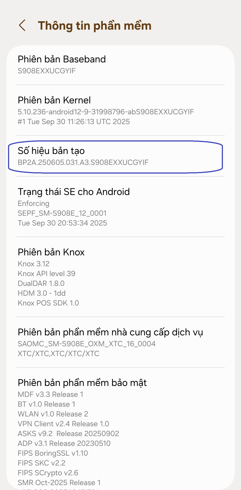
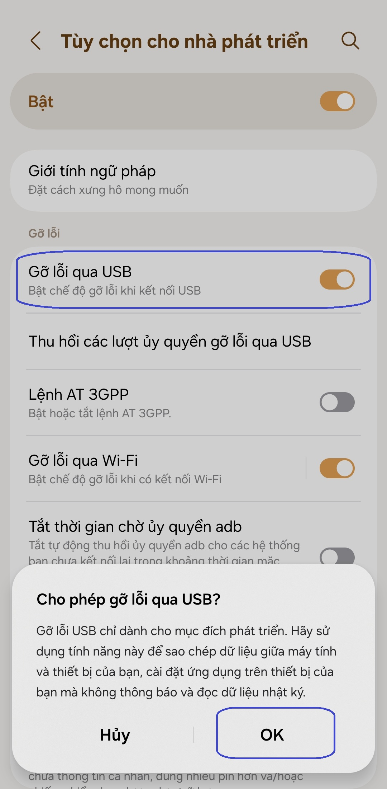
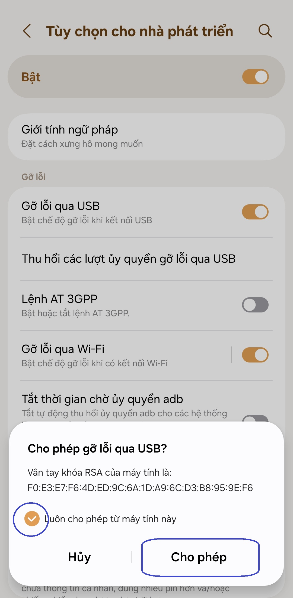

[English](../../README.md) | [Español](../es/README.md)
| [Português](../pt/README.md) | [Bahasa Indonesia](../in/README.md)
| [Русский](../ru/README.md) | [中文 (简体)](../zh-rCN/README.md) | [中文 (繁體)](../zh-rTW/README.md)
| [日本語](../ja-rJP/README.md) | <u>[Tiếng Việt](README.md)</u>
| [Türkçe](../tr/README.md)
| [हिन्दी](../hi/README.md) | [বাংলা (ভারত)](../bn-rIN/README.md) | [ਪੰਜਾਬੀ (ਭਾਰਤ)](../pa-rIN/README.md) | [తెలుగు](../te-rIN/README.md) | [اردو (پاکستان)](../ur-rPK/README.md) | [العربية](../ar/README.md) | [ไทย](../th/README.md)

----------------------

### Tóm tắt

* Thực thi `adb shell appops set com.tribalfs.realtimefps PROJECT_MEDIA allow`.
* Nếu sử dụng ứng dụng terminal android có quyền nâng cao, hãy thực thi
  `appops set com.tribalfs.realtimefps PROJECT_MEDIA allow`.

----------------------

Cấp quyền bằng máy tính:
----------------------

<details>

### 1. Bật chế độ nhà phát triển trong cài đặt của điện thoại

<details>

* Vào _Cài đặt_ > _Giới thiệu về điện thoại_ > _Thông tin phần mềm_ và nhấn vào _Số hiệu bản tạo_
  liên tục bảy (7) lần để bật tùy chọn nhà phát triển.

  

</details>

### 2. Bật gỡ lỗi USB

<details>

* Vào _Cài đặt_ > _Tùy chọn nhà phát triển_ (có thể là _Cài đặt_ > _Hệ thống_ > _Tùy chọn nhà phát
  triển_ trên các phiên bản Android cũ hơn), cuộn xuống và tìm tùy chọn _Gỡ lỗi qua USB_.

  

#### Ghi chú cho một số thiết bị như MIUI:

* Bật _Gỡ lỗi qua USB cho Cài đặt bảo mật_ nếu có trong tùy chọn Nhà phát triển.

* Bật tùy chọn _Tắt giám sát quyền_ nếu có trong tùy chọn Nhà phát triển. Cần khởi động lại.

</details>

### 3. Tải xuống ADB trên máy tính của bạn

<details>

* Tải ADB (platform-tools) về máy tính của bạn:
  cho [Windows](https://dl.google.com/android/repository/platform-tools-latest-windows.zip) |
  cho [Mac](https://dl.google.com/android/repository/platform-tools-latest-darwin.zip) |
  cho [Linux](https://dl.google.com/android/repository/platform-tools-latest-linux.zip)

* Giải nén tệp zip đã tải xuống.

</details>

### 4. Điều hướng đến bên trong thư mục

`platform-tools` mà bạn đã giải nén trên Windows Explorer hoặc Finder(macOS)

### 5. Mở giao diện dòng lệnh

  <details>

#### Đối với Windows: Mở CMD

* Nhập `cmd` vào thanh địa chỉ và nhấn enter. Thao tác này sẽ mở ứng dụng Dấu nhắc lệnh của Windows.


#### Đối với macOS:

* Nhấp đúp vào tệp zip đã tải xuống để mở, nhấp chuột phải vào thư mục `platform-tools` để mở menu
  ngữ cảnh và sau đó nhấp vào _Dịch vụ_ > _Terminal mới tại thư mục_.

</details>

### 6. Kết nối điện thoại với máy tính của bạn

  <details>

* Điện thoại của bạn sẽ nhắc _Cho phép gỡ lỗi USB_ nếu đây là lần đầu tiên được kết nối ở chế độ gỡ
  lỗi USB. Nhấn vào _Cho phép_ hoặc _OK_.
* Bạn có thể chọn _Luôn cho phép từ máy tính này_ (Vui lòng xem ghi chú ở cuối hướng dẫn này về việc
  bật gỡ lỗi USB).

  

* Kiểm tra kết nối bằng cách nhập lệnh sau rồi nhấn enter. Nó sẽ hiển thị ID thiết bị của bạn nếu
  kết nối thành công.

> ```adb devices```


* Nếu thiết bị của bạn không kết nối được với máy tính, hãy thử kết nối thiết bị với một cổng USB
  khác và/hoặc sử dụng một cáp dữ liệu USB khác. Nếu vẫn không kết nối được, có thể máy tính của bạn
  bị thiếu trình điều khiển USB cho điện thoại của bạn. Kiểm
  tra [tại đây để tải xuống trình điều khiển USB OEM](https://developer.android.com/studio/run/oem-usb#Drivers).
  Sau khi cài đặt, hãy khởi động lại PC của bạn và thực hiện lại bước số 6.

</details>

### 7. Cấp thực tế quyền PROJECT_MEDIA cho Real-time FPS Monitor

  <details>

* Khi kết nối thành công, hãy nhập lệnh sau và nhấn enter. Bạn có thể sao chép lệnh bên dưới. Nếu
  lệnh được thực thi đúng cách, nó sẽ trả về giá trị trống.

> ```adb shell appops set com.tribalfs.realtimefps PROJECT_MEDIA allow```

* Nếu nó nhắc `adb.exe: more than one device/emulator...`, hãy thực thi lệnh sauแทน:

>
```adb -s [device Id shown in step 6] shell appops set com.tribalfs.realtimefps PROJECT_MEDIA allow```


#### Lưu ý đối với MIUI, OnePlus và một số thiết bị khác

Nếu bạn gặp lỗi `java.lang.SecurityException: grantRuntimePermission`, hãy làm theo các bước sau:

1. Vào _Cài đặt_ > _Tùy chọn nhà phát triển_ (có thể là _Cài đặt_ > _Hệ thống_ > _Tùy chọn nhà phát
   triển_
2. Cuộn xuống và bật **Gỡ lỗi USB (Cài đặt bảo mật)**
3. Nếu có bất kỳ _Hộp thoại thận trọng_ nào xuất hiện, hãy làm theo các bước của nó để tiếp tục.
4. Khởi động lại thiết bị của bạn và thử lại các bước của Phần 7.

**Thế là xong!**
</details>

#### Bây giờ bạn có thể tắt cài đặt gỡ lỗi USB

* Vào _Cài đặt_ > _Tùy chọn nhà phát triển_, cuộn xuống một trang và **tắt** tùy chọn _Gỡ lỗi USB_.

</details>

----------------------
Cấp quyền không cần máy tính (sử dụng Shizuku):
----------------------
<details>

### Tùy chọn 1: Bạn có thể cài đặt [Shizuku](https://play.google.com/store/apps/details?id=moe.shizuku.privileged.api)*

và kích hoạt nó theo hướng dẫn được cung cấp. Sau đó, quay lại ứng dụng _Real-time FPS_ để cấp quyền
bằng Shizuku.

*Nếu phiên bản Play Store không hoạt động trên thiết bị của bạn, bạn có thể sử
dụng [bản fork Shizuku này](https://github.com/thedjchi/Shizuku/releases) thay thế.

</details>


----------------------

### Bạn không cần phải lặp lại quá trình này trừ khi bạn gỡ cài đặt hoàn toàn ứng dụng và cài đặt lại.


