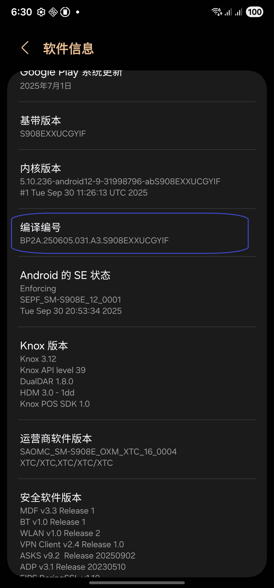
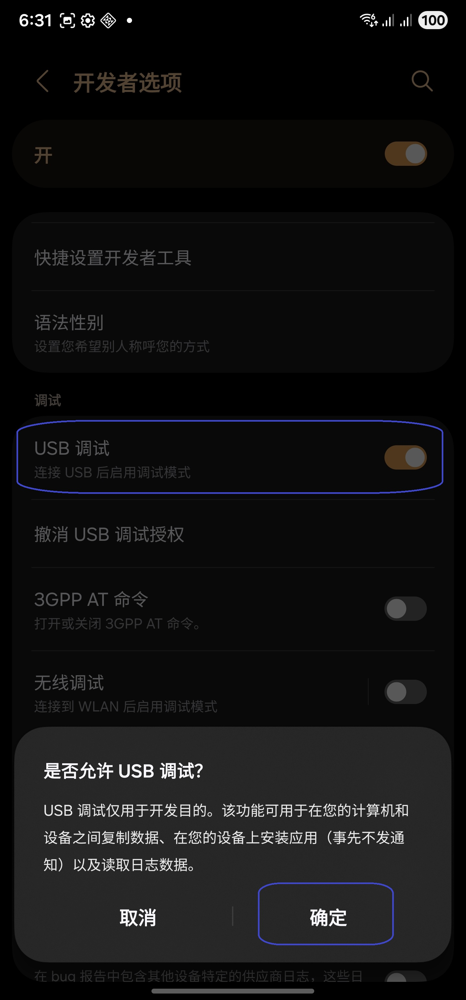
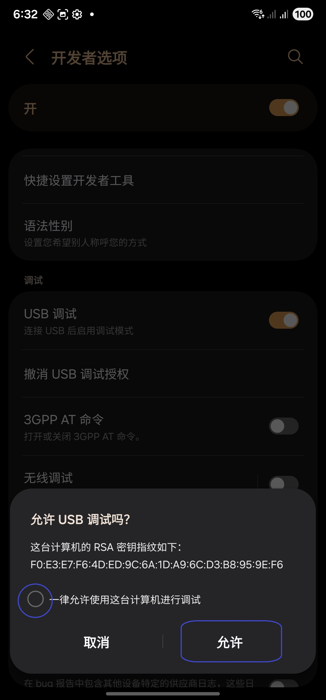

[English](../../README.md) | [Español](../es/README.md)
| [Português](../pt/README.md) | [Bahasa Indonesia](../in/README.md)
| [Русский](../ru/README.md) | <u>[中文 (简体)](README.md)</u> | [中文 (繁體)](../zh-rTW/README.md)
| [日本語](../ja-rJP/README.md) | [Tiếng Việt](../vi/README.md)
| [Türkçe](../tr/README.md)
| [हिन्दी](../hi/README.md) | [বাংলা (ভারত)](../bn-rIN/README.md) | [ਪੰਜਾਬੀ (ਭਾਰਤ)](../pa-rIN/README.md) | [తెలుగు](../te-rIN/README.md) | [اردو (پاکستان)](../ur-rPK/README.md) | [العربية](../ar/README.md) | [ไทย](../th/README.md)

----------------------

### 太长不看

* 执行 `adb shell appops set com.tribalfs.realtimefps PROJECT_MEDIA allow`。
* 如果使用具有提升权限的 android 终端应用程序，
  执行 `appops set com.tribalfs.realtimefps PROJECT_MEDIA allow`。

----------------------

使用 PC 授予权限：
----------------------

<details>

### 1. 在手机设置中启用开发者模式

<details>

* 转到“_设置_”>“_关于手机_”>“_软件信息_”，然后连续点击“_版本号_”七 (7) 次以启用开发者选项。
* 

</details>

### 2. 启用 USB 调试

<details>

* 进入“设置” > “开发者选项”（在
  旧版 android 上可以是“设置” > “系统” > “开发者选项”），向下滚动并找到“USB 调试”选项。

  

#### 某些设备（如 MIUI）的注意事项：

* 如果“开发者选项”中存在“USB 调试（安全设置）”，也请打开。

* 如果“开发者选项”中存在“禁用权限监控”选项，请打开。需要重新启动。

</details>

### 3. 在您的计算机上下载 ADB

<details>

* 将 ADB (platform-tools) 下载到您的计算机：
  [Windows 版](https://dl.google.com/android/repository/platform-tools-latest-windows.zip) |
  [Mac 版](https://dl.google.com/android/repository/platform-tools-latest-darwin.zip) |
  [Linux 版](https://dl.google.com/android/repository/platform-tools-latest-linux.zip)

* 解压缩下载的 zip 文件。

</details>

### 4. 导航到

您在 Windows 资源管理器或 Finder(macOS) 中解压缩的 `platform-tools` 文件夹

### 5. 打开命令行界面

<details>

#### 对于 Windows：打开 CMD

* 在地址栏中键入 `cmd` 并按 Enter。这将打开 Windows 命令提示符
  应用程序。


#### 对于 macOS：

* 双击下载的 zip 文件将其打开，右键单击 `platform-tools` 文件夹以打开上下文菜单，然后单击“服务” >
  “在文件夹中新建终端”。

</details>

### 6. 将手机连接到计算机

<details>

* 如果是第一次在 USB 上连接
  调试模式，您的手机将提示“允许 USB 调试”。点按“允许”或“确定”。
* 您可以选中“始终允许从此计算机”（请在
  本教程末尾查看有关保持启用 USB 调试的说明）。

  

* 通过输入以下命令并按 Enter 来检查连接。如果连接成功，它应该会显示您的
  设备 ID。

```adb devices```


* 如果您的设备无法连接到您的计算机，请尝试将其连接到其他 USB 端口和/或
  使用不同的 USB 数据线。如果仍然无法连接，则您的计算机可能缺少
  您手机的 USB 驱动程序。
  在此处[下载 OEM USB 驱动程序](https://developer.android.com/studio/run/oem-usb#Drivers)。
  安装后，重新启动您的 PC 并重做第 6 步。

</details>

### 7. 实际授予 Real-time FPS Monitor PROJECT_MEDIA 权限

<details>

* 连接成功后，输入以下命令并按 Enter。您可以复制
  下面的命令。如果命令执行正确，它将返回空白。

```adb shell appops set com.tribalfs.realtimefps PROJECT_MEDIA allow```

* 如果提示 `adb.exe: more than one device/emulator...`，请改为执行以下命令：

>
```adb -s [device Id shown in step 6] shell appops set com.tribalfs.realtimefps PROJECT_MEDIA allow```


#### MIUI、OnePlus 和其他一些设备的注意事项

如果您收到 `java.lang.SecurityException: grantRuntimePermission` 错误，请按照以下步骤操作：

1. 进入“设置” > “开发者选项”（可以是“设置” > “系统” > “开发者选项”）
2. 向下滚动并启用 **USB 调试（安全设置）**
3. 如果出现任何“警告对话框”，请按照其步骤进行操作。
4. 重新启动您的设备并重试第 7 节的步骤。

**就是这样！**
</details>

#### 您现在可以禁用 USB 调试设置

* 进入“设置” > “开发者选项”，向下滚动一页并 **禁用** “USB 调试”选项。

</details>

----------------------
不使用 PC 授予权限（使用 Shizuku）：
----------------------
<details>

### 选项 1：您可以安装 [Shizuku](https://play.google.com/store/apps/details?id=moe.shizuku.privileged.api)*

并按照其提供的指南激活它。然后返回 _Real-time FPS_ 应用以使用 Shizuku 授予权限。

*如果 Play
商店版本在您的设备上不起作用，您可以改用此 [Shizuku 分支](https://github.com/thedjchi/Shizuku/releases)。

</details>


----------------------

### 除非您完全卸载并重新安装该应用程序，否则您不必重复此过程。
